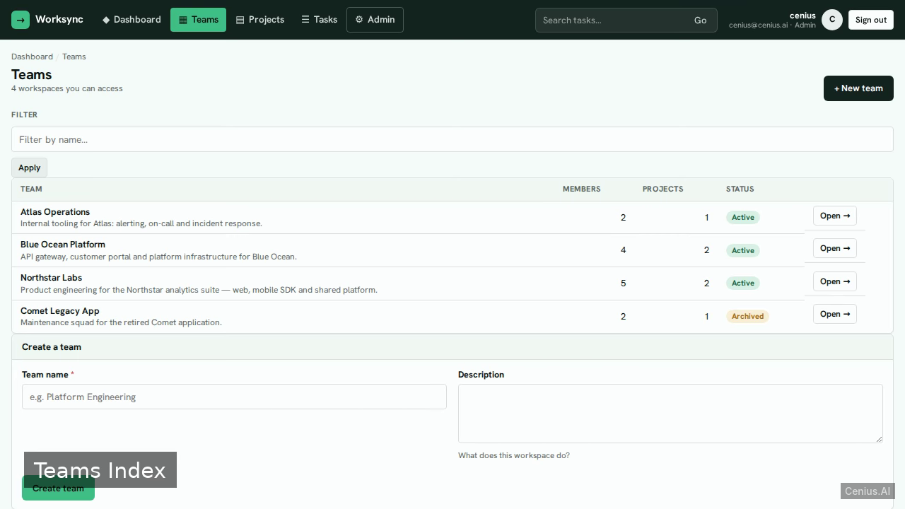
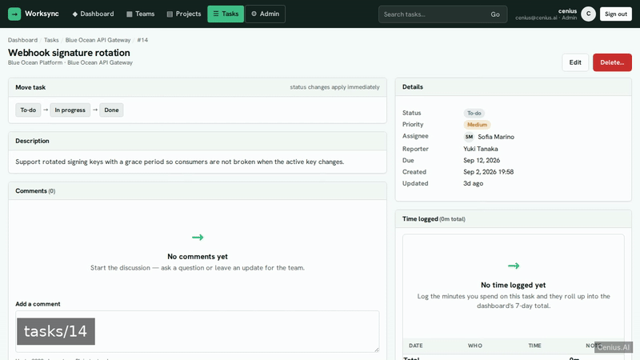
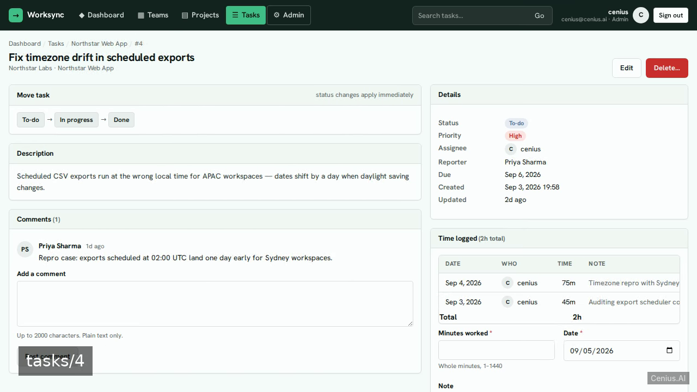
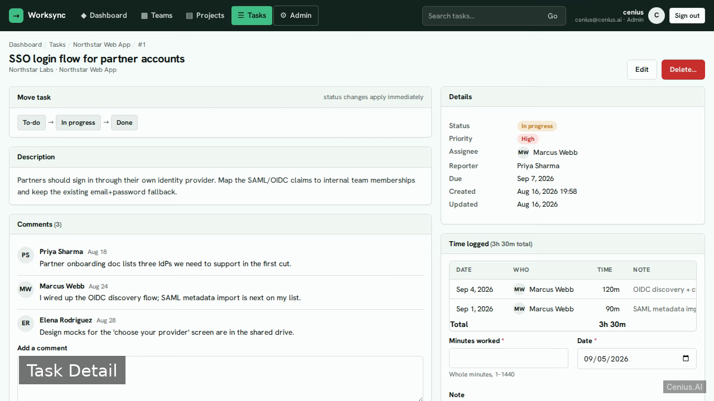

# Worksync — Team Project Manager — Scala monitoring dashboard reference implementation

**Worksync — Team Project Manager** is Apache-2.0-licensed and fully open-source: a monitoring dashboard written in Scala that you can run, modify, and ship commercially without restrictions. We'll build Worksync, a production-quality team project manager using Scala 3 + http4s (sbt; never Play), PostgreSQL in Docker Compose, and server-rendered HTML with Tailwind CSS and Alpine.js. Grab Worksync — Team Project Manager from this repo and self-host it, or [remix it on cenius.ai](https://cenius.ai/marketplace/p/worksync-team-project-manager?ref=gh&utm_campaign=worksync-team-project-manager-scala) — the platform grants full rebrand rights on every change.


[](LICENSE)  [](https://cenius.ai)

[](https://cenius.ai/marketplace/p/worksync-team-project-manager?ref=gh&utm_campaign=worksync-team-project-manager-scala)

> **▶ [Open & edit in cenius.ai](https://cenius.ai/marketplace/p/worksync-team-project-manager?ref=gh&utm_campaign=worksync-team-project-manager-scala)** — one click to an editable workspace: describe changes in plain English, get an instant preview, one-click deploy and host. Modifications made on the platform come with full rebrand & relicense rights.

_Local clone? See [Quick start](#quick-start) below. cenius.ai is the zero-setup path._

## Demo





▶ **[Watch the full demo video](https://cenius.ai/marketplace/p/worksync-team-project-manager?ref=gh&utm_campaign=worksync-team-project-manager-scala)** — the complete walkthrough, playing on the project's cenius.ai page · [MP4 file](.github/media/demo.mp4)

## Screenshots

  

## Features

- Session-cookie authentication with admin/member roles
- Dashboard summary and visual insights
- Team workspaces and team membership
- Project lifecycle and project workspace
- Task CRUD and status workflow
- Comments on tasks
- Time tracking on tasks
- Global task search and filtering
- Admin user management and role enforcement
- Form validation, error states, and empty states

## Quick start

```bash
./install.sh   # installs dependencies + seeds demo data
```

See [`INSTALL.md`](INSTALL.md) for full setup and usage instructions.

## Architecture

Folder layout: `project/`, `src/`. `./install.sh` gets you from a fresh clone to a running instance with sample data in a single step. Built in Scala (97 files). See [`INSTALL.md`](INSTALL.md) for complete setup instructions.

## Usage guide

Sign in with the demo **Admin** (`cenius@cenius.ai` / `cenius`) or **Member** (`member@worksync.dev` / `member123`) — the credentials are shown on the login card.

### Dashboard (`/app`)
Four stat cards (active projects, open tasks, tasks assigned to you, minutes logged in the last 7 days), an SVG status-distribution chart, and the six most recently updated tasks. Quick actions create a team/project/task. Members only ever see aggregates from teams they belong to; the empty state appears for brand-new accounts.

### Teams (`/teams`, `/teams/{id}`)
- Filter by name; create a team (you become owner + first member).
- On the team page: edit name/description, archive/restore, delete (only when the team has no projects and no other members), add teammates by email, remove members (owners can't be removed).
- Admins see every team; Members see only the teams they belong to (anything else is a styled 403).

### Projects (`/projects`, `/projects/{id}`)
- Search + team filter + All/Active/Archived tabs; create a project inside any active team you belong to (names must be unique per team).
- The project page shows a progress summary, team members, and the task **board** grouped into To-do / In progress / Done columns with due dates, priorities and assignees. New-task form, edit, archive/restore and delete (empty projects only) are on the page.

_Full guide: [`USAGE.md`](USAGE.md)_

## FAQ

### What's the quickest way to self-host Worksync — Team Project Manager?

Clone this repository and run `./install.sh`, then start the app as described in [`INSTALL.md`](INSTALL.md). Worksync — Team Project Manager is fully self-hostable — no external services are required to try it.

### What technologies are in Worksync — Team Project Manager's stack?

Scala. The full source in this repository is exactly what the app runs. Highlights include comments on tasks.

### How do I customise Worksync — Team Project Manager's branding?

Yes. You can edit the source directly under the MIT license, or [remix it on cenius.ai](https://cenius.ai/marketplace/p/worksync-team-project-manager?ref=gh&utm_campaign=worksync-team-project-manager-scala) — the platform route grants full rebrand and relicense rights over your derivative.

### Can I build a business on Worksync — Team Project Manager?

Yes — it ships under the Apache-2.0 license, which permits commercial use, modification and redistribution. The full text is in [LICENSE](LICENSE).

### Can I change Worksync — Team Project Manager without writing code?

Yes — [load it on cenius.ai](https://cenius.ai/marketplace/p/worksync-team-project-manager?ref=gh&utm_campaign=worksync-team-project-manager-scala), describe the change in plain English, and you get back a fresh build with your modification applied.

## License & rebranding

Released under the [Apache License 2.0](LICENSE) (© 2026 Cenius AI) — free for personal and commercial use. The Cenius name/logo are trademarks (see NOTICE).

**Need a customized version?** [Remix this app on cenius.ai](https://cenius.ai/marketplace/p/worksync-team-project-manager?ref=gh&utm_campaign=worksync-team-project-manager-scala) — modifications made on the platform come with **full rebrand & relicense rights** over your derivative.

## Built with cenius.ai

This entire application — code, design, seeded demo data — was generated on **[cenius.ai](https://cenius.ai)** from a plain-English description.

- 🚀 [Build your own app on cenius.ai](https://cenius.ai)
- 🎛️ [Remix Worksync — Team Project Manager on the marketplace](https://cenius.ai/marketplace/p/worksync-team-project-manager?ref=gh&utm_campaign=worksync-team-project-manager-scala) — open it in a workspace, prompt for changes, and ship your own version.

More open-source apps: [the Cenius-ai catalog](https://github.com/Cenius-ai) · [showcase index](https://github.com/Cenius-ai/showcase)
